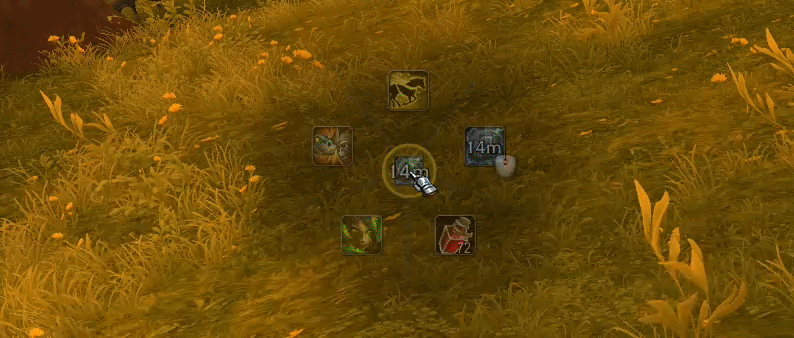
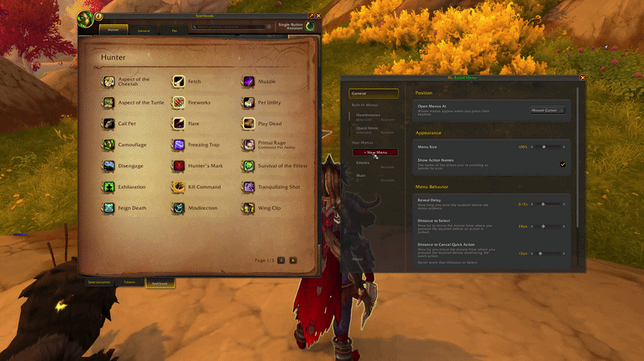
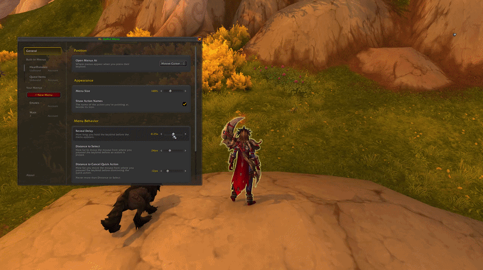
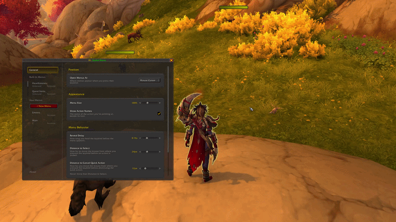

# RL: Radial Menu

Radial menus for your spells, items, toys, mounts and markers, in the style of the game's ping
wheel. **Hold a key, flick the mouse, release.**

- One keybind per menu, as many menus as you like.
- Works in combat.
- Built-in menus that fill themselves: quest items, hearthstones, trinkets, season teleports,
  markers, specializations and talent loadouts.
- A **quick action** for a tap: press and release without moving, and the action fires without
  the menu ever appearing.

## Getting started

1. Type `/radial`, or open it from the addon drawer on the minimap.
2. On the **Menus** tab, click **+ New Menu**.
3. Click **Keybind** and press the key (or combination) you want to hold.
4. Add actions: click **+** on the menu and search, or drag spells, items, toys, macros and
   mounts straight from your spellbook, bags or collections onto it.

Then hold your key in the game, move the mouse toward an action and let go.

## Using a menu

- **Pick an action:** hold the keybind, move the mouse toward the action, release.
- **Cancel:** move back to the center (the X) and release.
- **Quick action:** tap the keybind without moving the mouse. Release before the **Reveal
  Delay** and the menu never even shows. The quick action can be the last
  action you used, a fixed one, or an action that's only on the tap and not in the menu.

## What a menu can hold

| Action | | Retail | Forever |
|---|---|:---:|:---:|
| Spells | including pet abilities, and spells from flyouts such as portals and dungeon teleports | ✓ | ✓ |
| Items | consumables show how many you have; hidden while you have none | ✓ | ✓ |
| Toys, Mounts, Battle Pets | from your collections, plus a random favorite mount or pet | ✓ | ✓ |
| Macros | your account and character macros | ✓ | ✓ |
| Emotes | | ✓ | ✓ |
| Pet Commands | Attack, Follow, Stay, stances, ...; hidden while you have no pet | ✓ | ✓ |
| Target Markers | Skull, Cross, ... on your target, and Clear | ✓ | ✓ |
| World Markers | placed under the mouse, or with a targeting circle; and Clear | ✓ | ✓ |
| Equipped Slot | uses whatever is in that slot (trinket 1, ...); hidden while it has no use effect | ✓ | ✓ |
| Zone Ability, Extra Action | follow the game's buttons; hidden while there's none | ✓ | — |
| Specializations | switch to another spec of your class; hidden while it's your current one | ✓ | — |
| Talent Loadouts | load a saved build for your current spec; hidden while it's the active one | ✓ | — |
| Submenus | another of your menus inside this one (below) | ✓ | ✓ |

Actions that have nothing to fire right now (an item you're out of, a pet ability with no pet)
are left out of the menu until they're usable again. Cooldowns and charges show on the icons.

**Submenus:** a menu can contain another menu. By default it takes one slot: while holding your
keybind, **scroll the mouse wheel** over it to cycle through its actions, then release on the
one shown. Double-click it in the settings to **spread** its actions into the menu instead.

## Built-in menus

These fill themselves and stay up to date. Give them a keybind and rearrange them as you like.

| Menu | What's in it | Retail | Forever |
|---|---|:---:|:---:|
| Quest Items | usable quest items from your quest log and bags (Forever: from your bags) | ✓ | ✓ |
| Hearthstones | your Hearthstone and the hearthstone toys you own | ✓ | — |
| Trinkets & On-Use | every equipped item with a use effect | ✓ | ✓ |
| Season Teleports | the current Mythic+ season's dungeon teleports you've earned | ✓ | — |
| Target Markers | all eight target markers, and Clear | ✓ | ✓ |
| World Markers | all eight world markers, and Clear | ✓ | ✓ |
| Zone and Extra | the Zone Ability and the Extra Action Button | ✓ | — |
| Specializations | the specs of your class you can switch to | ✓ | — |
| Talent Loadouts | your current spec's saved builds, except the active one | ✓ | — |

## Settings

Everything is in `/radial` (also under Options → AddOns).

- **Open Menus At:** at the mouse cursor, or at a **Fixed Position** you place in Edit Mode
  (saved per Edit Mode layout).
- **Select From** (fixed position): pick by the direction you move from where you pressed the
  key, or by where the mouse is over the menu itself.
- **Show Cursor Guide** (fixed position): a faint outline of the menu at the cursor, so you can
  see the directions while the menu is elsewhere.
- **Menu Size** and **Show Action Names**.
- **Menu Behavior:** Reveal Delay, Distance to Select, Distance to Cancel Quick Action, and
  how world markers are placed.
- **Per menu:** name, keybind, quick action, and whether it's on all your characters or just
  this one.

## Game versions

- **Retail** (Midnight): everything above.
- **WoW Forever:** loads and works, without the parts marked — in the tables above.

## Credits and licence

RL: Radial Menu is free software under the **GNU General Public License v3** (see `LICENSE` and
`NOTICE`).

- The settings window and its UI toolkit (`libs\AX_Settings`, `libs\AX_Modules`) are based on
  **WaypointUI** by **AdaptiveX** (GPLv3).
- Fixed position via **LibEditMode** by p3lim.
- The menu's look follows Blizzard's ping wheel.
